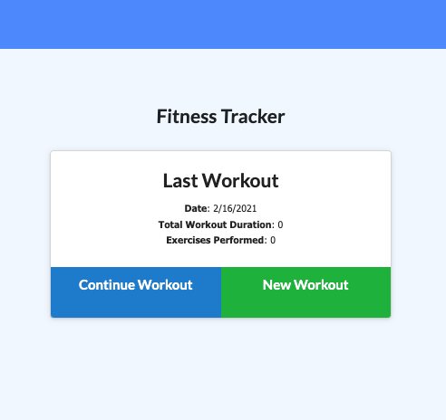

# Stay Fit & Track- What does the project do?

## User Story

* As a user, I want to be able to view create and track daily workouts. I want to be able to log multiple exercises in a workout on a given day. I should also be able to track the name, type, weight, sets, reps, and duration of exercise. If the exercise is a cardio exercise, I should be able to track my distance traveled.

## Business Context

A consumer will reach their fitness goals more quickly when they track their workout progress.

### Links to the project

* GitHub Repo:
(https://github.com/sosingh1226/stayfitAndTrack)

* Deployed Heroku Link: 
(https://stayfitandtrack.herokuapp.com/?id=602f53cd10ee371af35637d8)

## Challenges

Using MongoDB & Mongoose for various functions, connecting database and developing a connection between back end and front end. 

Highlight: Mongoose is Case Sensitive!! I spent couple days just to figure that out.

To deploy an application with a MongoDB database to Heroku, you'll need to set up a MongoDB Atlas account and connect a database from there to your application. Be sure to use the following guides for support:

  * [Set Up MongoDB Atlas](../04-Important/MongoAtlas-Setup.md)

  * [Deploy with Heroku and MongoDB Atlas](../04-Important/MongoAtlas-Deploy.md)
